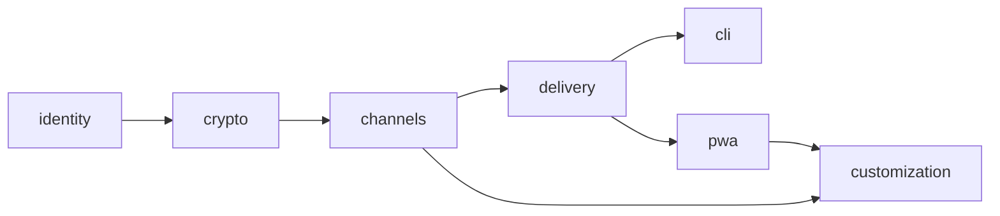

# Capability map — Chiflame

Módulos estables. Los ids no se renombran. Specs, PRs e implementación se refieren a estos ids.

| Module id | Responsabilidad | Depende de | Spec |
|---|---|---|---|
| `identity` | Cuentas, passphrase, pairing CLI↔PWA, devices, revoke | — | [SPEC-identity.md](./SPEC-identity.md) |
| `crypto` | KDF, jerarquía de claves, envelope, formatos de ciphertext | identity | [SPEC-crypto.md](./SPEC-crypto.md) |
| `channels` | Inbox, canales personales, members, slugs, retención | identity, crypto | [SPEC-channels.md](./SPEC-channels.md) |
| `delivery` | Persistencia, Realtime, Web Push, receipts, swipe-delete | channels | [SPEC-delivery.md](./SPEC-delivery.md) |
| `cli` | `chifla` npm, agent-first, tokens de device | identity, channels, delivery | [SPEC-cli.md](./SPEC-cli.md) |
| `pwa` | PWA, unlock, inbox, settings, SW, install/push | identity, channels, delivery | [SPEC-pwa.md](./SPEC-pwa.md) |
| `customization` | Colores, prioridad, mute, quiet hours, temas | pwa, channels | (spec en v1.1; v1 mínimo vive en pwa/channels) |

## Dependencias



Sin ciclos. `cli` y `pwa` son paralelos después de `delivery`.

## Build order (implementación futura)

```text
identity → crypto → channels → delivery → cli ∥ pwa → customization
```

Vertical slice de confianza (cuando se codee, no ahora):

1. Signup/unlock + tabla `profiles` con wrapped keys.
2. Crear canal `inbox` + CDK.
3. Pair CLI (QR + código) e intercambio de CDK.
4. `chifla "hola"` inserta ciphertext.
5. PWA inbox descifra. Push wake-up + SW decrypt.

## Interfaces en el borde

| De → a | Contrato |
|---|---|
| identity → crypto | `user_id`, KDF params, public_key X25519, wrapped_user_key |
| crypto → channels | wrap/unwrap CDK con public_key del miembro |
| channels → delivery | `channel_id`, membership, `muted`, `priority` default |
| delivery → cli/pwa | fila `messages` (ciphertext + meta); topic Realtime `chifla:user:{id}`; push wake-up |
| identity → cli | device JWT + wrapped CDKs vía pairing |
| identity → pwa | sesión Auth + unlock local |

El detalle de cada contrato está en el spec del **proveedor** (el módulo de la izquierda).
