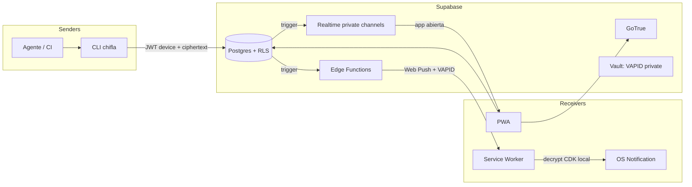
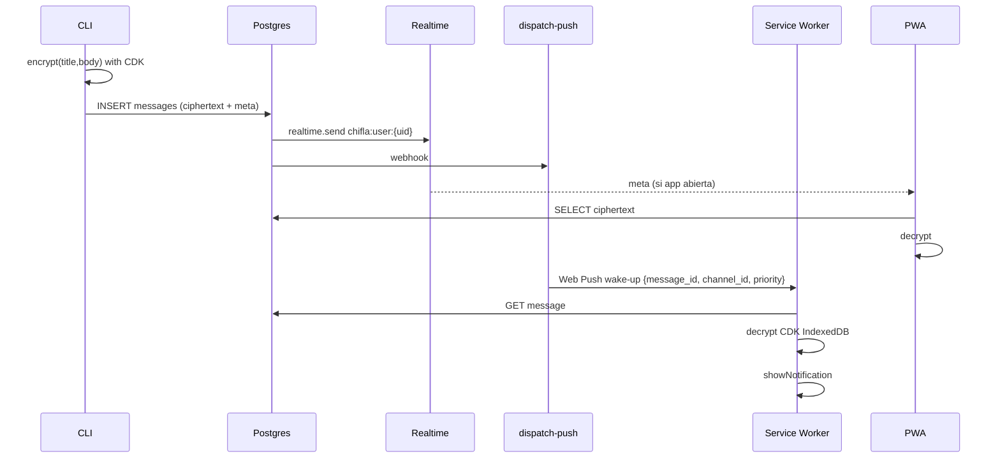

# Arquitectura

## Vista global



Monorepo previsto (no creado en esta fase):

```text
apps/web                 PWA
packages/cli             binario chifla
packages/crypto          KDF, wrap, message codec (compartido)
packages/protocol        tipos JSON de pairing / send / wake-up
supabase/                migraciones + functions
docs/                    este pack
```

## Camino de `chifla "done"`



Si el fetch del SW falla: notificación genérica “Nueva chifla”.

## Por qué tres caminos

| Canal | App abierta | App cerrada | Historia | E2E |
|---|---|---|---|---|
| Realtime Broadcast | sí | no | replay ~3 días, no es inbox | blob cifrado ok |
| Web Push | ruido si se usa para live | sí | no | wake-up; decrypt local |
| Tabla `messages` | sí | al abrir | sí | ciphertext en disco |

Inbox = Postgres. Live = Realtime. Background = Web Push.

**Rechazado:** Postgres Changes sobre `messages` como fan-out principal (no escala; Realtime recomienda Broadcast from DB).

## Servicios

Ver [05-supabase.md](./05-supabase.md). Resumen:

- Auth, Postgres+RLS, Realtime private, Edge Functions, Vault (VAPID), Database Webhook / `pg_net`.
- Storage: no en v1.

## Topics Realtime

| Topic | Uso |
|---|---|
| `chifla:user:{user_id}` | Live inbox del usuario. `private: true`. |

Pairing **no** usa Realtime: HTTP poll (`pair-poll`). No hay topic por canal en v1 (el cliente filtra por `channel_id`). v1.1 puede añadir `chifla:channel:{id}` si hay shared.

## Límites

| Límite | Valor v1 | Motivo |
|---|---|---|
| TTL pairing | 3 minutos, un uso | QR robado inútil |
| Tamaño plaintext mensaje | 4 KiB | Web Push / UX; el wake-up no lleva el body |
| Safari iOS payload push | ~2 KiB | por eso wake-up chico |
| Retención default | 30 días | purge cron |
| Rate send | 60/min por user (ajustable) | abuso |
| Devices CLI activos | 20 | sanity |
| PWAs con push | 10 | sanity |
| Verify code | 6 chars Crockford (`K7F2Q9`) | lectura humana |

## Auth de la CLI

Tras pairing, la CLI usa una **sesión GoTrue del mismo `user_id`** (magic link interno, ver `pair-complete`). `device_id` **no** va en `app_metadata` (eso es por usuario y pisa el segundo CLI).

La CLI guarda `device_id` en config y lo manda como `sender_device_id`. RLS: el device pertenece a `auth.uid()` y `revoked_at is null`.

No hay service role en el CLI. Detalle: [06-edge-functions.md](./06-edge-functions.md).

## Secretos del deployment

| Secret | Dónde | Notas |
|---|---|---|
| `VAPID_PUBLIC_KEY` | Edge + PWA (público) | Un par por instancia |
| `VAPID_PRIVATE_KEY` | solo `dispatch-push` | nunca en el cliente |
| `VAPID_SUBJECT` | `mailto:` o URL de contacto | RFC 8292 |
| Supabase URL + anon key | CLI y PWA | públicos por diseño |
| Service role | solo Edge Functions | nunca en CLI/PWA |

La PWA pide el VAPID **público** al subscribe (`PushManager.subscribe({ applicationServerKey })`).
