# Flujos

Páginas y guards: [08-pwa.md](./08-pwa.md). Pantallas: [10-wireframes.md](./10-wireframes.md).

---

## Mapa de navegación PWA (cerrado)

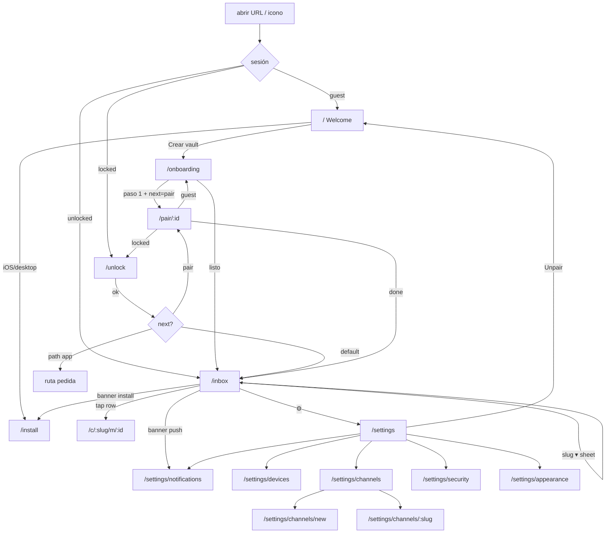

Deep link QR siempre entra por `/pair/:id` y el mapa de arriba aplica.

---

## 1. First-run PWA-first

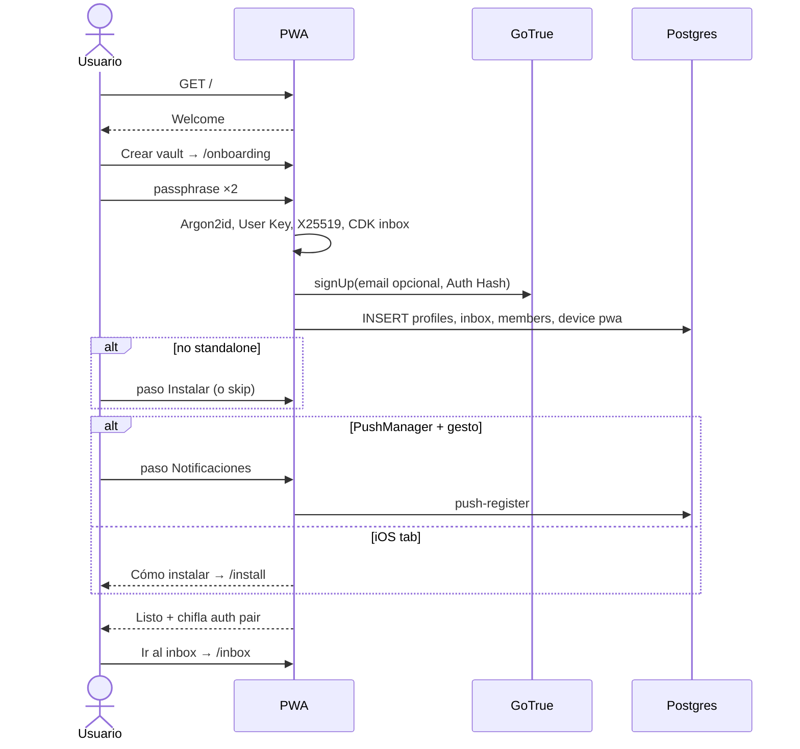

## 2. First-run CLI-first (QR)

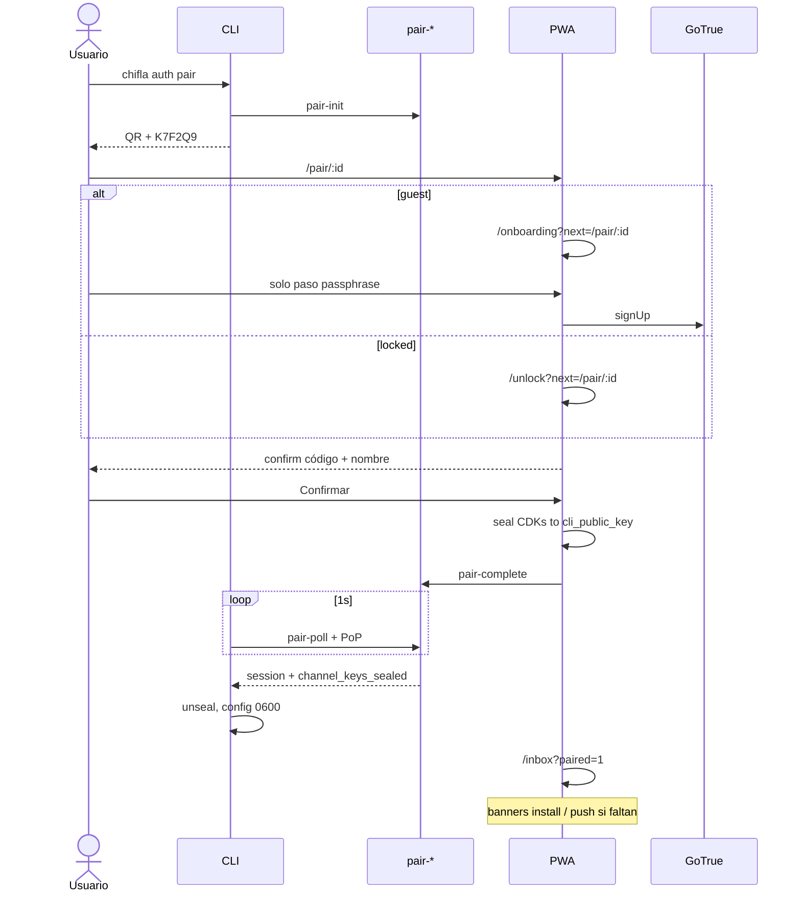

## 3. Send feliz

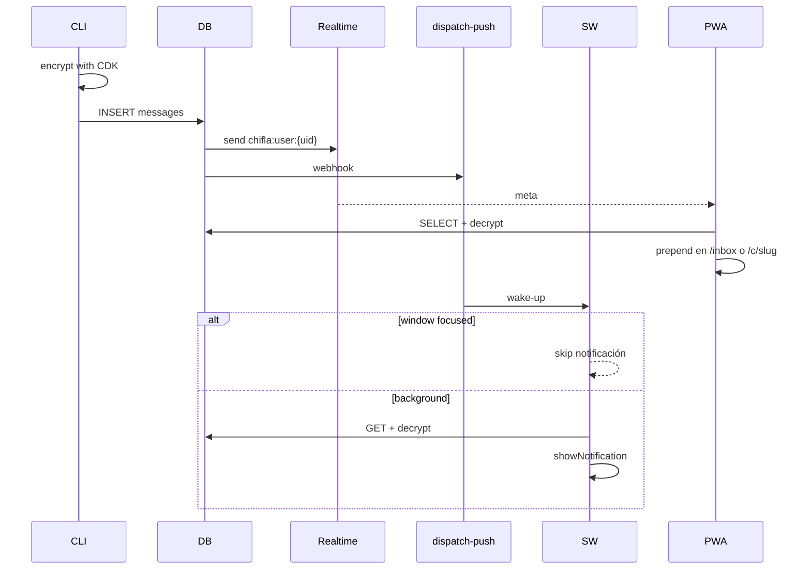

## 4. App abierta vs cerrada + tap

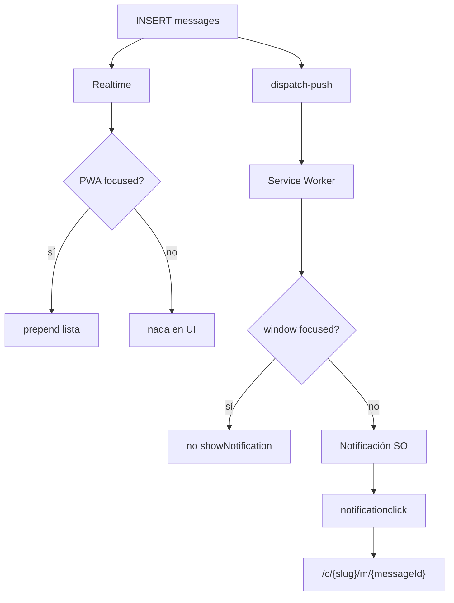

## 5. Swipe delete + undo

```mermaid
sequenceDiagram
  actor U
  participant PWA
  participant DB

  U->>PWA: swipe derecha en /c/slug
  PWA->>PWA: saca row optimistic
  PWA->>DB: upsert message_acks deleted_at=now()
  PWA-->>U: snackbar Undo 5s
  alt undo
    U->>PWA: Undo
    PWA->>DB: deleted_at=null
    PWA->>PWA: restaura
  else timeout
    Note over PWA: tombstone; otros devices del user ocultan al refetch
  end
```

No `DELETE` de `messages`.

## 6. Revoke CLI

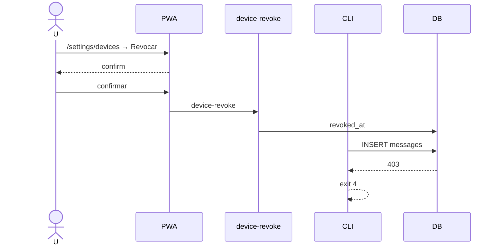

## 7. Re-pair máquina nueva

Flujo 2 con cuenta existente (`locked` o `unlocked`). CDKs se sellan al nuevo `cli_public_key`. El CLI viejo sigue válido hasta revoke.

## 8. iOS install gate

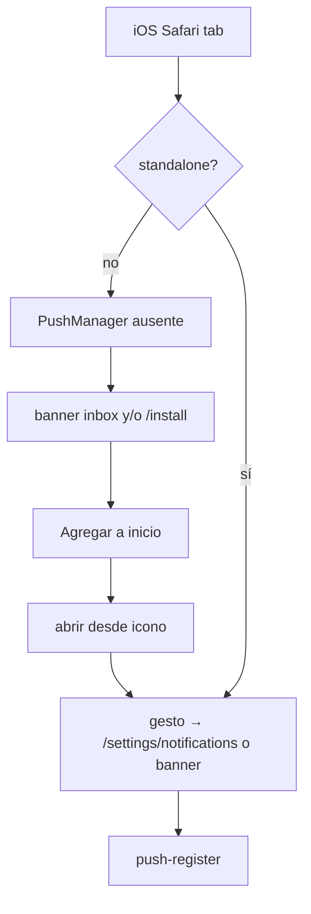

## 9. Agente

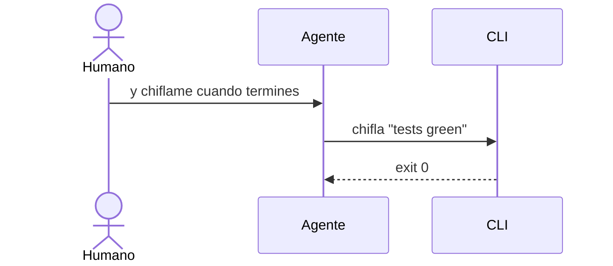

El agente no navega la PWA. Pairing es humano.

---

## 10. Unlock cotidiano

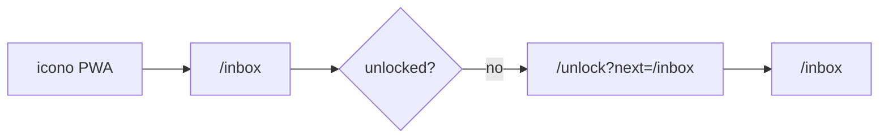

## 11. Unpair this PWA

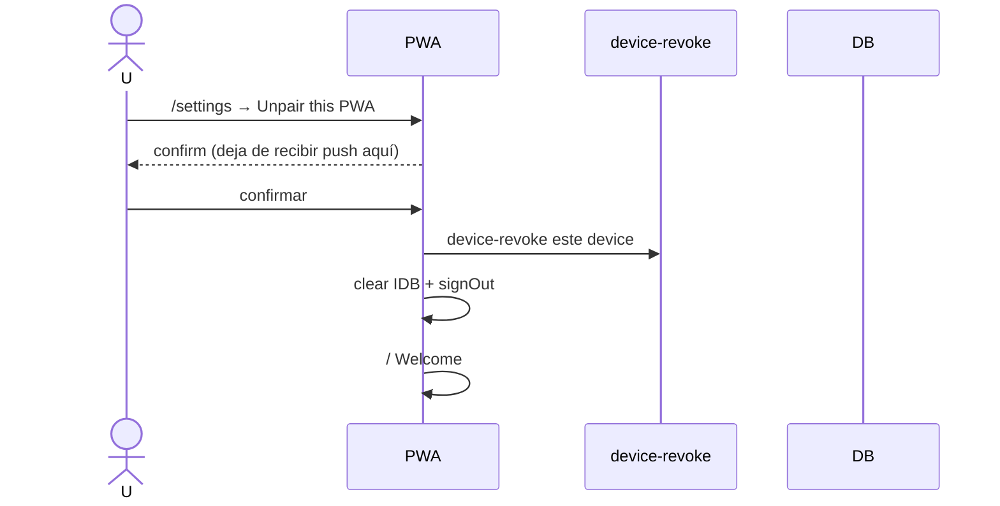

## 12. Crear canal

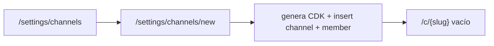

## 13. Pairing error

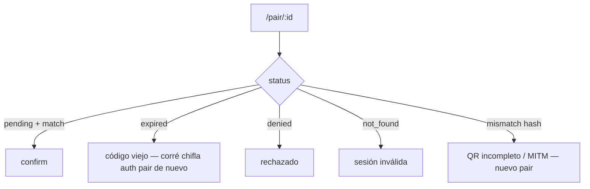
